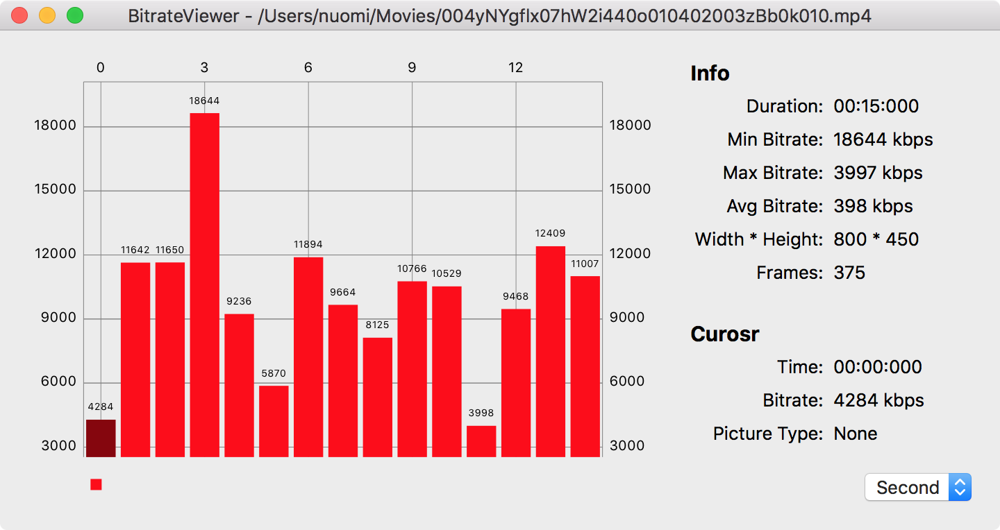
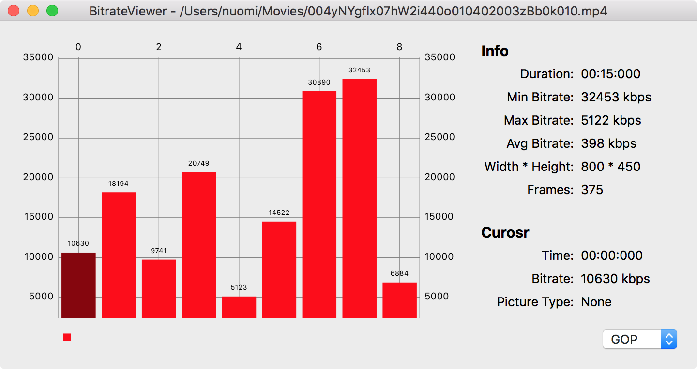
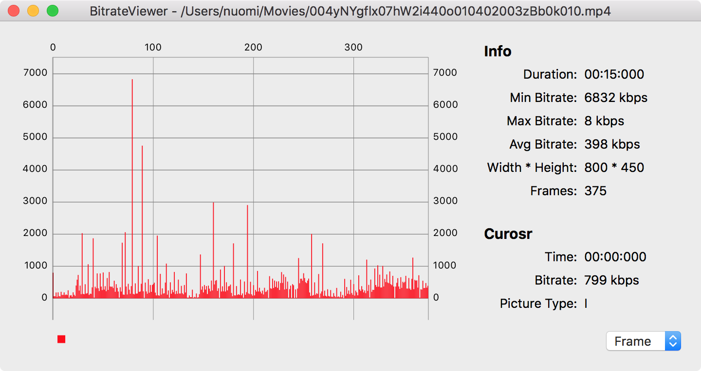

# BitrateViewer

## Requirements

- macOS 10.11
- Xcode 10.2
- Swift 5.0

## Screenshot

## Thanks

- [Bitrate Viewer](http://www.winhoros.de/docs/bitrate-viewer/)
- [BitrateViewer](https://github.com/galad87/BitrateViewer)
- [Charts](https://github.com/danielgindi/Charts)
- [SnapKit](https://github.com/SnapKit/SnapKit)
- [RxSwift](https://github.com/ReactiveX/RxSwift)
- [FFmpeg](https://ffmpeg.org/)
