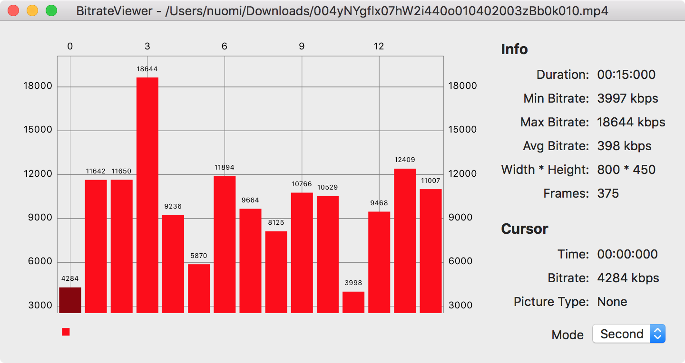
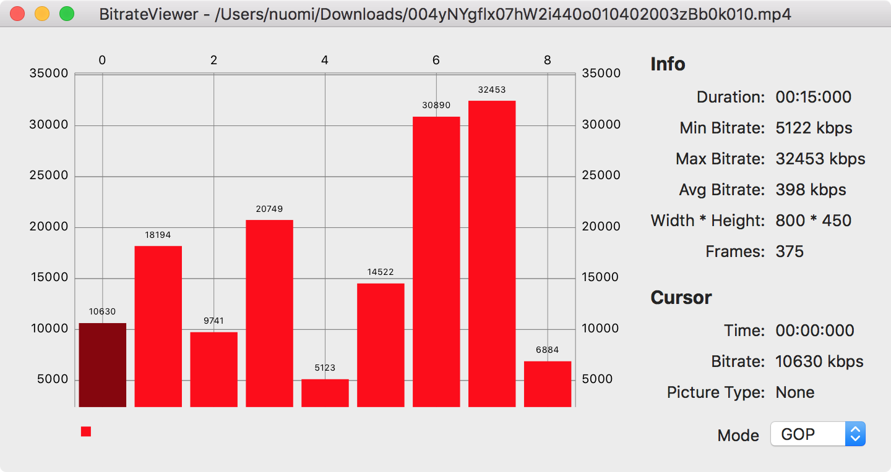
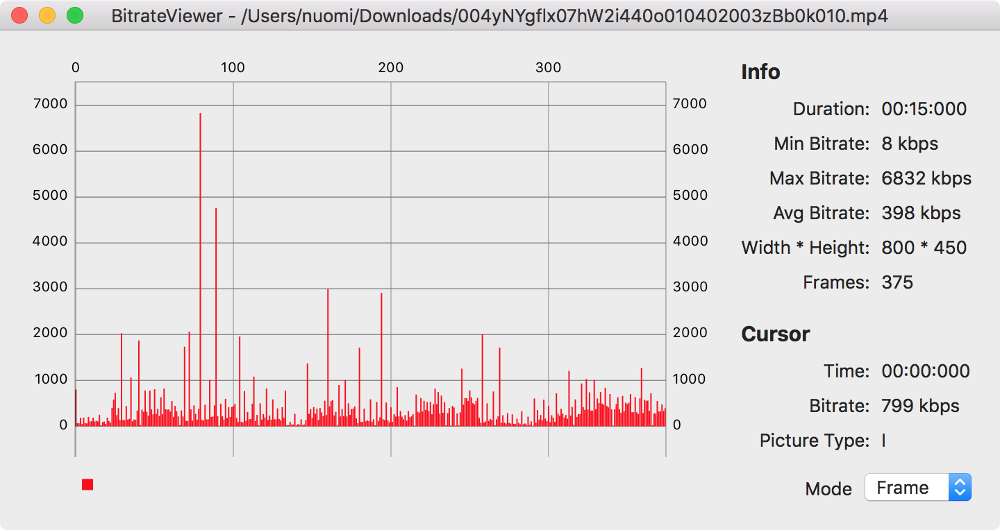

# BitrateViewer

## Environment

- macOS 10.13.3
- Xcode 9.2
- Swift 4.0.3

## Snapshot

## Thanks

- [Bitrate Viewer](http://www.winhoros.de/docs/bitrate-viewer/)
- [BitrateViewer](https://github.com/galad87/BitrateViewer)
- [Charts](https://github.com/danielgindi/Charts)
- [FFmpeg](https://ffmpeg.org/)
